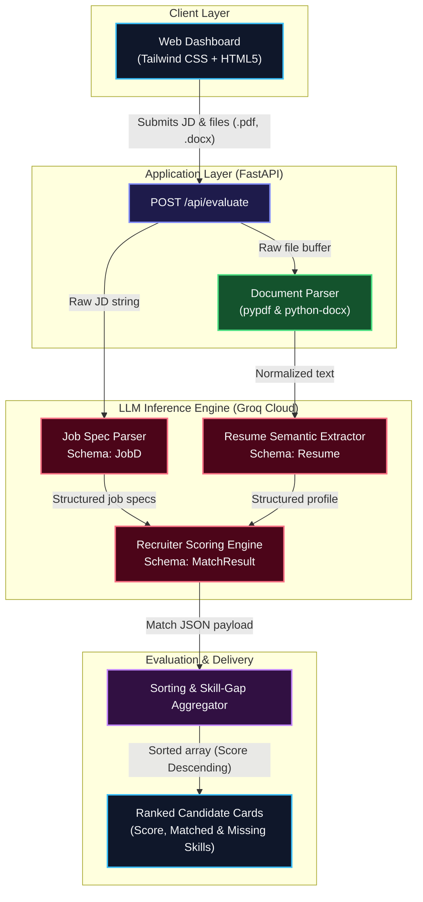

# Smart ATS Engine & AI Resume Evaluator

**Live Application URL:** [https://smart-ats-engine-backend.onrender.com](https://smart-ats-engine-backend.onrender.com)

An automated applicant screening and resume evaluation engine powered by **FastAPI**, **Pydantic**, and **Groq's ultra-low-latency LLM inference**. It processes candidate resumes (`.pdf`, `.docx`), extracts structured candidate profiles, benchmarks qualifications against technical job descriptions, and renders a beautifully sorted candidate dashboard complete with quantitative skill gap analysis.

---

## 🏗️ System Architecture & Workflow

The architecture is built for sub-second, multi-agent parsing and semantic ranking by offloading processing steps straight to Groq's high-speed inference arrays.



---

## ✨ Key Features

*   **Multi-Format Document Parsing:** Handles zero-overhead, in-memory text extraction directly from `.pdf` (via `pypdf`) and `.docx` (via `python-docx`).
*   **Deterministic Structured Outputs:** Utilizes strict Pydantic parsing schemas (`JobD`, `Resume`, `MatchResult`, `MatchDetails`) to guarantee highly reliable, validated system responses from open-weights LLMs.
*   **Deep Recruiter Evaluation Logic:** Assesses hard technical proficiencies, infers context-dependent soft skills, reviews historical professional experience milestones, and flags missing critical criteria.
*   **Single-Service Architecture:** Mounts a fully responsive, dark-mode Tailwind CSS dashboard directly through FastAPI's `StaticFiles`, eliminating heavy Node.js framework building pipelines entirely.
*   **Groq-Accelerated Pipeline:** Leverages lightning-fast LPUs for immediate parallel resume screening, mapping, and instant stack ranking.

---

## 🛠️ Tech Stack

*   **Backend framework:** Python 3.12+, FastAPI, Uvicorn, Pydantic v2
*   **Package Manager:** uv (Astral)
*   **LLM Core Engine:** Groq Cloud API 
*   **Document Parsers:** pypdf, python-docx
*   **Frontend UI:** HTML5, Tailwind CSS, Vanilla JS
*   **Cloud Deployment:** Render Cloud Platform

---

## 📁 Project Structure

```plaintext
smart-ats-engine-backend/
├── job_descriptions/       # Reference target job descriptions
├── resumes/                # Evaluation test resumes (.pdf, .docx)
├── static/
│   └── index.html          # Web UI dashboard interface
├── .env.example            # Environment configuration template
├── .gitignore              # Git file ignore rules
├── api.py                  # FastAPI server setup & application endpoints
├── pyproject.toml          # Project metadata, configuration, and lock schema
├── resume_evaluator2.py    # Main evaluation pipeline & prompt generation templates
└── README.md               # Documentation entry point
```

---

## 🚀 Local Development

### 1. Clone the repository
```bash
git clone https://github.com/<YOUR_USERNAME>/smart-ats-engine-backend.git
cd smart-ats-engine-backend
```

### 2. Configure Environment Variables
Copy the distribution environment configuration file:
```bash
cp .env.example .env
```
Open your newly created `.env` file and insert your dedicated Groq endpoint credentials:
```env
GROQ_API_KEY=gsk_your_groq_api_key_here
```

### 3. Install Dependencies with `uv`
Ensure you have Astral's `uv` toolchain installed locally, then run sync:
```bash
uv sync
```

### 4. Boot up the Application Server
Run the asynchronous web server instance locally:
```bash
uv run uvicorn api:app --reload --port 8000
```
Navigate your browser to **[http://localhost:8000](http://localhost:8000)** to immediately interact with your smart dashboard.
